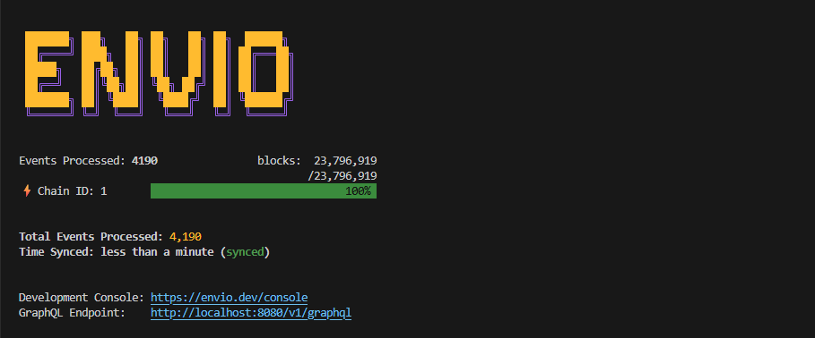

# M0 Indexer

*Please refer to the [documentation website](https://docs.envio.dev) for a complete guide to all [Envio](https://envio.dev) indexer features.*

This repo migrates one of the subgraphs from the [M0 subgraphs repo](https://github.com/m0-foundation/subgraphs/tree/main) to [HyperIndex](https://docs.envio.dev/docs/HyperIndex/overview).



## Pre-requisites

* [Node.js (v18 or newer)](https://nodejs.org/en/download/current)
* [pnpm (v8 or newer)](https://pnpm.io/installation)
* [Docker Desktop](https://www.docker.com/products/docker-desktop/)

## Local Development

To run the indexer on your machine, first clone the repo and then run the following command:

```bash
pnpm dev
```

Visit [https://envio.dev/console](https://envio.dev/console) to open the GraphQL Playground.

If you modify `config.yaml` or `subgraph.yaml`, run the following command to regenerate types:

```bash
pnpm codegen
```

## Changes Required for Migration

You can find the full guide for migrating from The Graph to HyperIndex here:
[https://docs.envio.dev/docs/HyperIndex/migration-guide](https://docs.envio.dev/docs/HyperIndex/migration-guide)

All event handlers are located in the `src/EventHandlers.ts` file. Below is a breakdown of one example event and the changes made to both the GraphQL schema and the event handler.

This project was initialized using `pnpx envio init`, and the files were updated according to the migration guide.

## `IndexUpdated` Event Handler

Changes made to the new `schema.graphql` file:

```diff graphql
- type MTokenIndexUpdated @entity(immutable: true) {
-   id: Bytes!
-   index: BigInt! # uint128
-   rate: BigInt! # uint32
-   blockNumber: BigInt!
-   blockTimestamp: BigInt!
-   transactionHash: Bytes!
- }

+ type IndexUpdated {
+   id: String! # Envio uses String type for IDs
+   index: BigInt!
+   rate: BigInt!
+   blockNumber: Int! # BigInt -> Int, as HyperIndex uses Int for block numbers
+   blockTimestamp: Int! # BigInt -> Int, as HyperIndex uses Int for timestamps
+   transactionHash: String!
+ }
```

Original event handler (The Graph):

```ts
export function handleIndexUpdated(event: IndexUpdatedEvent): void {
  let entity = new IndexUpdated(
    event.transaction.hash.concatI32(event.logIndex.toI32())
  );
  entity.index = event.params.index;
  entity.rate = event.params.rate;

  entity.blockNumber = event.block.number;
  entity.blockTimestamp = event.block.timestamp;
  entity.transactionHash = event.transaction.hash;

  entity.save();
}
```

New HyperIndex event handler:

```ts
MToken.IndexUpdated.handler(async ({ event, context }) => {
  const id = makeEventId(event.transaction.hash, event.logIndex);

  const entity: IndexUpdated = {
    id,
    index: event.params.index,
    rate: event.params.rate,
    blockNumber: event.block.number,
    blockTimestamp: event.block.timestamp,
    transactionHash: event.transaction.hash,
  };

  context.IndexUpdated.set(entity);
});
```